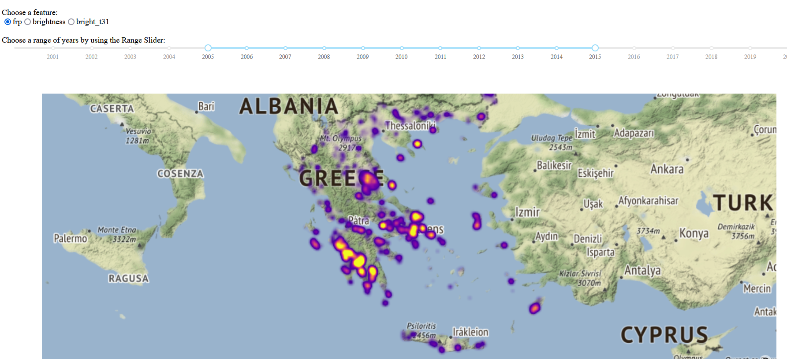

# Greek-Fires-Dashboard
An attempt to create my first interactive Dashboard using Dash to present in an interactive format the fires per year.

This is my first attempt to create a Dashboard by using Plotly Dash. The data used is from Kaggle.com and [Baris Dincer](https://www.kaggle.com/datasets/brsdincer/2000-2021-tunisiaisraelgreeceitaly-nasa)

Besides the data required I used the following libraries: [Pandas](https://pandas.pydata.org/),[Dash](https://plotly.com/dash/), and the Mapbox Density Heatmap from [Plotly](https://plotly.com/python/mapbox-density-heatmaps/). Also used [Jupyter Dash](https://github.com/plotly/jupyter-dash) to present the dash results by using the Jupyter Notebook.

I used a radio selector and range slider selector to filter the data and provide interactivity for the dashboard. The radio selector selects the appropriate satellite data set. The range slider selects the range of years (or the specific year) the user would like to select to observe the fires burning in Greece for the specific set of years.

I have also managed to deploy online the dashboard app via Heroku so that it is available for all to use in their browsers.

Visit https://greek-forest-fires.herokuapp.com/  to use the interactive dashboard.

Please provide comments and feedback. Also note that the Jupyter file and the Python file of the Dashboard are slightly different since the jupyter was used for development of the app locally and the python file for the deployment online.

Last but not least I would like to thank [Konstantinos Kanaris](https://github.com/KostantinosKan) for helping me with the Heroku deployment.

